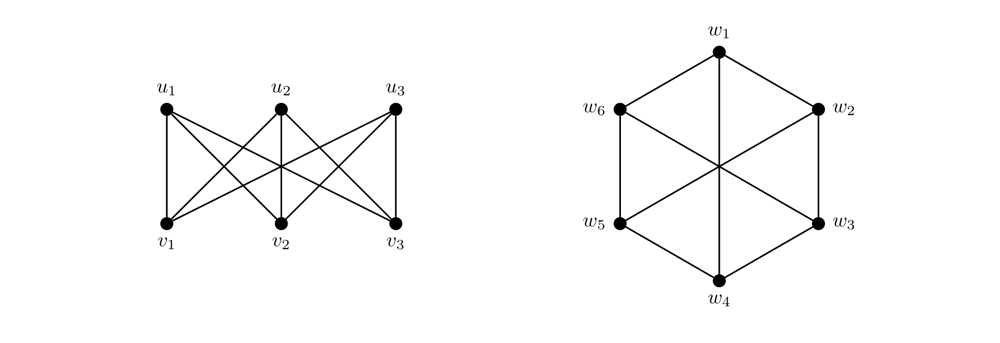
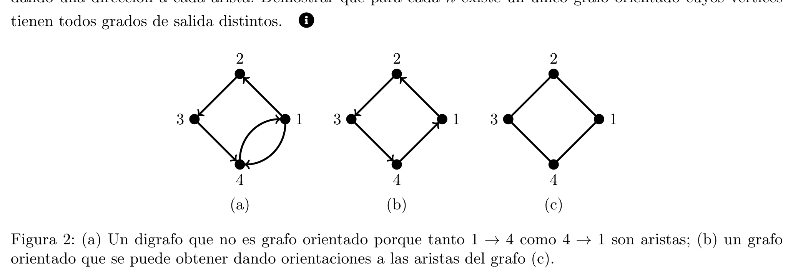
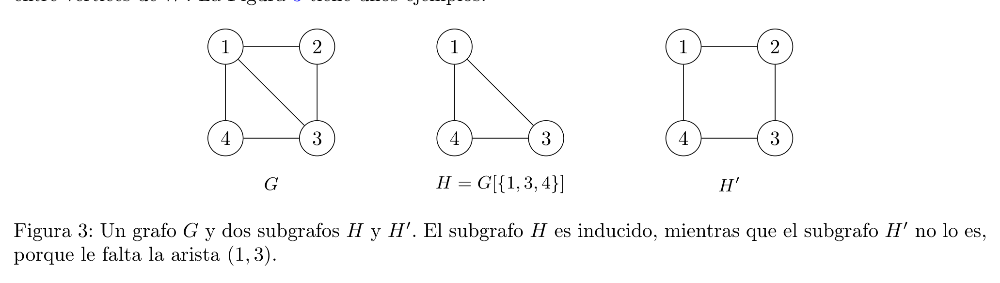

# Práctica 2: Introducción a grafos

> **Técnicas de Diseño de Algoritmos / Algoritmos y Estructuras de Datos III**  
> **Ejercicios de Contenido Mínimo (⋆)**

El objetivo de esta práctica es introducir a definiciones y demostraciones sobre grafos y digrafos.

Un grafo $G$ es un objeto con un conjunto de vértices $V(G)$ y un conjunto de aristas $E(G)$, donde cada arista es un par no ordenado de vértices.

---

## Ejercicio 1 (Isomorfismo) ⋆

Dos grafos $G$ y $H$ son isomorfos si existe una biyección $f : V(G) \to V(H)$, llamada isomorfismo, tal que para todo $u, v \in V(G)$ tenemos que $(u, v) \in E(G)$ si y sólo si $(f(u), f(v)) \in E(H)$. En otras palabras, $G$ e $H$ son isomorfos si se pueden renombrar los vértices de $G$ para obtener $H$.

Decidir si los siguientes grafos son isomorfos entre sí. Si lo son, dar un isomorfismo entre ellos.

---

## Ejercicio 2 (Estamos todos conectados) ⋆

Recordemos que un grafo $G$ es conexo si para todo par de vértices $u, v \in V(G)$ existe un camino entre $u$ y $v$ formado por aristas de $G$.

Federico dice que todos los grafos de $n \ge 2$ vértices cuyos grados sean todos por lo menos 1 son conexos. Da la siguiente demostración por inducción en la cantidad de vértices $n$ del grafo:

> **Caso base ($n = 2$):** El único grafo de dos vértices cuyos grados son todos por lo menos 1 es el $K_2$ (el grafo de dos vértices con una arista entre ellos), que es claramente conexo.
>
> **Paso inductivo ($n \ge 3$):** Veamos que agregar un vértice a un grafo $G$ de $n - 1$ vértices no desconecta el grafo. Al agregar el vértice $v$, necesariamente tenemos que agregar también por lo menos una arista que haga que $v$ tenga grado por lo menos 1. Por lo tanto $v$ está conectado al resto del grafo, y entonces el nuevo grafo de $n$ vértices es conexo. $\square$

Daiana dice que tiene un grafo que es un contraejemplo de lo que dice Fede.

a) Mostrar un contraejemplo que podría tener Dai.

b) ¿Qué error tuvo Fede?

c) Considerar esta versión más rigurosa de la demostración de Fede:

> Vamos a demostrar por inducción en la cantidad de vértices $n$ el siguiente predicado:
>
> $P(n) := \text{“Todo grafo de } n \ge 2 \text{ vértices cuyos grados sean todos por lo menos 1 es conexo”.}$
>
> **Caso base ($P(2)$):** El único grafo de dos vértices cuyos grados son todos por lo menos 1 es el $K_2$ (el grafo de dos vértices $u$ y $v$ con una arista entre ellos). Como $u, v$ es un camino entre los únicos dos vértices del grafo, $K_2$ es conexo. Por lo tanto, $P(2)$ es verdadero.
>
> **Paso inductivo ($\\forall n \in \mathbb{N}_{\ge 2} : (P(n) \implies P(n + 1))$):** Sea $n \in \mathbb{N}_{\ge 2}$. Asumimos que vale $P(n)$ y queremos ver que vale $P(n + 1)$.
>
> Sea $G$ un grafo de $n$ vértices cuyos grados son todos por lo menos 1. Por hipótesis inductiva, $G$ es conexo. Agreguemos un vértice $v$ a $G$ y una arista que conecte $v$ con un vértice de $G$. El nuevo grafo $G'$ tiene $n + 1$ vértices y los grados de todos sus vértices son por lo menos 1. Como $v$ está conectado a un vértice de $G$, y $G$ es conexo, existe un camino entre $v$ y cualquier otro vértice de $G$. Por lo tanto, para todo par de vértices de $G'$, existe un camino entre ellos, y por lo tanto $G'$ es conexo. Luego, $P(n + 1)$ es verdadero. $\square$

¿Se arregló el error de Fede, o sigue siendo falsa su demostración? ¿Por qué?

d) Fede está segurísimo de que lo que dice es correcto, y para mostrárselo a Dai, reemplaza el paso inductivo de la demostración rigurosa por el siguiente, empezando con un grafo de $n + 1$ vértices y sacando un vértice en vez de agregando uno:

> [...] **Paso inductivo ($\\forall n \in \mathbb{N}_{\ge 2} : (P(n) \implies P(n + 1))$):** Sea $G$ un grafo de $n + 1$ vértices cuyos grados son todos por lo menos 1. Saquemos un vértice arbitrario $v$ de $G$. El grafo $G - v$ tiene $n$ vértices y los grados de todos sus vértices son por lo menos 1, así que podemos aplicar la hipótesis inductiva a $G - v$. Por lo tanto, $G - v$ es conexo. Como $v$ tenía grado por lo menos 1, tiene por lo menos un vecino $w$ en $G - v$. Como $G - v$ es conexo, existe un camino entre $w$ y cualquier otro vértice de $G - v$. Adjuntamos $v$ a cada camino para crear caminos de $v$ a todos los otros vértices en $G$. Como todos los pares de vértices tienen caminos entre sí, $G$ es conexo. $\square$

¿Ahora cuál fue su error? ¿Es el mismo de antes? ¿En qué frase exactamente dijo algo falso?

---

## Ejercicio 3 (Árboles) ⋆

Un árbol es un grafo conexo sin ciclos. Dado un grafo $G$ de $n \ge 2$ nodos sin nodos de grado 0, ¿cuáles de los siguientes ítems garantizan que $G$ es un árbol? Para los ítems que no garanticen que $G$ sea un árbol, dar un contraejemplo.

a) $G$ tiene $n - 1$ aristas.

b) $G$ tiene exactamente 2 nodos de grado 1.

c) $G$ tiene exactamente 2 nodos de grado 1 y $n - 1$ aristas.

d) $G$ tiene exactamente 2 nodos de grado 1 y no tiene ciclos.

e) $G$ tiene exactamente 2 nodos de grado 1 y es conexo.

f) $G$ tiene exactamente 2 nodos de grado 1 y todos los demás nodos tienen grado 2.

---

## Ejercicio 4 (Suma de grados) ⋆

Demostrar por inducción en la cantidad de aristas $|E(G)|$ que para todo grafo $G$ se cumple que:

$$
\sum_{v \in V(G)} \deg(v) = 2 \cdot |E(G)|
$$

Recordar que para un vértice $v$ de un grafo $G$:

$$
\deg(v) := |\{e \in E(G) \mid e \text{ incide en } v\}|
$$

---

## Ejercicio 5 (Equilibrio digrafo) ⋆

Demostrar, usando inducción en la cantidad de aristas, que todo digrafo $D$ satisface:

$$
\sum_{v \in V(D)} d_{in}(v) = \sum_{v \in V(D)} d_{out}(v) = |E(D)|
$$

---

## Ejercicio 6 (Doble grado) ⋆

Demostrar, usando la técnica de reducción al absurdo, que todo grafo no trivial tiene al menos dos vértices del mismo grado.

---

## Ejercicio 7 (Muchas aristas implica conexo) ⋆

Demostrar, usando inducción en la cantidad de vértices, que todo grafo de $n$ vértices que tiene más de $\frac{(n - 1)(n - 2)}{2}$ aristas es conexo. Opcionalmente, puede demostrar la misma propiedad usando otras técnicas de demostración.

---

## Ejercicio 8 (Unicidad digrafo) ⋆

Un grafo orientado es un digrafo $D$ tal que al menos uno de $v \to w$ y $w \to v$ no es una arista de $D$, para todo $v, w \in V(D)$ (ver Figura 2). En otras palabras, un grafo orientado se obtiene a partir de un grafo no dirigido dando una dirección a cada arista. Demostrar que para cada $n$ existe un único grafo orientado cuyos vértices tienen todos grados de salida distintos.

*Figura 2: (a) Un digrafo que no es grafo orientado porque tanto $1 \to 4$ como $4 \to 1$ son aristas; (b) un grafo orientado que se puede obtener dando orientaciones a las aristas del grafo (c).*

---

## Ejercicio 9 (Dos caminos implican ciclo) ⋆

Sean $P$ y $Q$ dos caminos distintos (no necesariamente disjuntos en vértices) de un grafo $G$ que unen un vértice $v$ con otro $w$. Demostrar en forma directa que $G$ tiene un ciclo donde cada arista pertenece a $P$ o a $Q$.

---

## Ejercicio 10 (Subgrafos) ⋆

Un grafo $H$ es un subgrafo de un grafo $G$ si resulta de eliminar algunos (puede ser cero) vértices y aristas arbitrarios de $G$, y posiblemente renombrar vértices. Un subgrafo inducido de un grafo $G$ es un subgrafo de $G$ que resulta de solamente eliminar vértices de $G$, eliminando solo las aristas adyacentes a vértices eliminados. El subgrafo de $G$ inducido por los vértices $W \subseteq V(G)$ es el subgrafo inducido $G[W]$ de $G$ resultado de eliminar todos los vértices de $V(G) \setminus W$, es decir, resultado de quedarse solo con los vértices de $W$, y todas las aristas entre vértices de $W$. La Figura 3 tiene unos ejemplos.

*Figura 3: Un grafo $G$ y dos subgrafos $H$ y $H'$. El subgrafo $H$ es inducido, mientras que el subgrafo $H'$ no lo es, porque le falta la arista $(1, 3)$.*

Considerar el grafo completo $K_n$ de $n$ vértices que tiene todas las posibles aristas entre cada par de vértices. Es decir:

$$
V(K_n) := \{1, \dots, n\}
$$

$$
E(K_n) := \{(u, v) \mid u, v \in V(K_n) \land u \ne v\}
$$

a) Notar que todos los grafos de hasta $n$ vértices son subgrafos de $K_n$.

b) Demostrar que no todos los grafos de hasta $n$ vértices son subgrafos inducidos de $K_n$.

c) Determinar cuáles son los grafos que sí son subgrafos inducidos de $K_n$.

---

## Ejercicio 11 (Particiones conexas) ⋆

Sea $C$ un conjunto. Una familia de $k$ conjuntos $\{S_1, \dots, S_k\}$ es una partición de $C$ si resulta de repartir todos los elementos de $C$ en $k$ cajas, sin dejar ninguna vacía. Más formalmente, $\{S_1, \dots, S_k\}$ es una partición de $C$ si se cumplen todas las siguientes condiciones:

1. $S_i \ne \emptyset$ para todo $i \in \{1, \dots, k\}$;
2. $S_i \subseteq C$ para todo $i \in \{1, \dots, k\}$;
3. $\bigcup_{i=1}^k S_i = C$; y
4. $S_i \cap S_j = \emptyset$ para todos $i \ne j \in \{1, \dots, k\}$.

a) Mostrar un grafo conexo $G$ y una partición de sus vértices $V(G)$ en dos conjuntos $A$ y $B$ tal que ni $G[A]$ ni $G[B]$ son conexos. ¿Para todo grafo existe esta partición?

b) Demostrar que un grafo es conexo si y sólo si para toda partición en dos conjuntos $A$ y $B$ de $V(G)$ existe una arista en $E(G)$ con un extremo en $A$ y otro en $B$. Usar la definición de grafo conexo y de camino, no sólo la intuición.

---

## Ayudas

### Ejercicio 4
Definir claramente el predicado $P(n)$ que queremos demostrar por inducción, y luego hacer el paso inductivo tomando un grafo $G$ cualquiera con $n + 1$ aristas y sacándole una arista cualquiera para aplicar la hipótesis inductiva.

### Ejercicio 6
Prestar atención a la secuencia ordenada de los grados de los vértices.

### Ejercicio 8
Demostrar de forma constructiva que existe uno, y mostrar que cualquier otro que cumpla la propiedad es isomorfo al primero.

### Ejercicio 9
Denotar $P = v_0, \dots, v_p$ y $Q = w_0, \dots, w_q$ con $v_0 = w_0 = v$ y $v_p = w_q = w$. Considerar qué vértices se comparten y cuáles no se comparten entre los dos caminos. Con eso en mente, definir explícitamente cuáles son los subcaminos de $P$ y $Q$ cuya unión forman un ciclo.

### Ejercicio 11
Probar la vuelta por contrarrecíproco.
