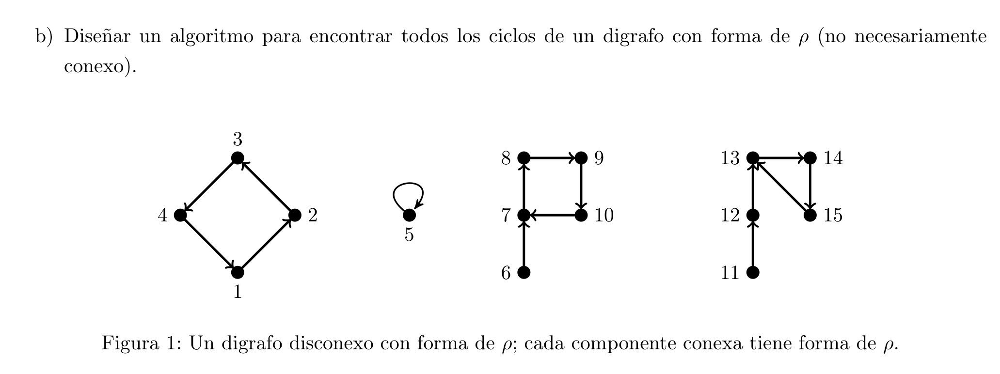
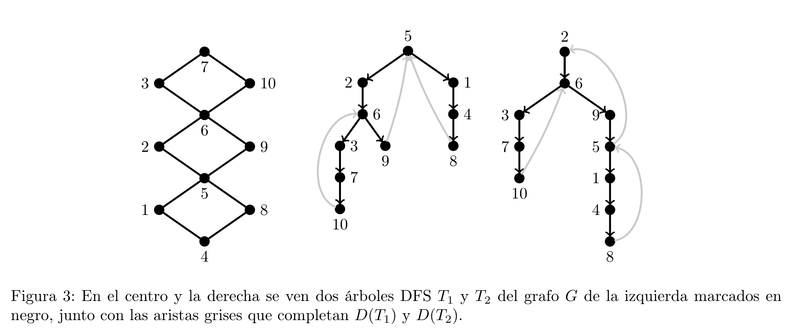

<strong>Técnicas de Diseño de Algoritmos / Algoritmos y Estructuras de Datos III</strong>

Facultad de Ciencias Exactas y Naturales — Universidad de Buenos Aires

<strong>Práctica 3 – Algoritmos sobre grafos (Contenidos Mínimos)</strong>

# Práctica 3 – Algoritmos sobre grafos

> **Objetivos de la práctica:**
> - Practicar resolver problemas sobre grafos con algoritmos.
> - Familiarizarse con algoritmos de búsqueda comunes sobre grafos (BFS y DFS).
>
> Los ejercicios marcados con el símbolo $\star$ constituyen un subconjunto mínimo de ejercitación.
> Los ejercicios marcados con el símbolo $\star$ que cuentan con sugerencias tienen su correspondiente ayuda en la sección [Ayudas](#ayudas) al final de la guía.

---

## Ejercicio 1 (Representación de grafos) $\star$

Para un grafo $G$, el conjunto de vecindarios (o conjunto de adyacencias) es un par $(V, N)$ donde $N$ es una función que asigna a cada vértice $v \in V(G)$ su correspondiente conjunto de vértices adyacentes $N(v)$, es decir, su vecindario.

En todos los grafos $G$ que tengamos como entrada los vértices van a ser el conjunto $\{0, \dots, |V(G)| - 1\}$.

Discutir (brevemente) las ventajas y desventajas en cuanto a la complejidad temporal y espacial de las siguientes implementaciones de un conjunto de vecindarios para un grafo $G$, de acuerdo a las siguientes operaciones:

### Operaciones
1. Inicializar la estructura a partir de una secuencia de vértices y una secuencia de aristas de $G$.
2. Determinar si dos vértices $v$ y $w$ son adyacentes.
3. Recorrer y/o procesar el vecindario $N(v)$ de un vértice $v$ dado.
4. Insertar un vértice $v$ con su conjunto de vecinos $N(v)$.
5. Insertar una arista $(v, w)$.
6. Remover un vértice $v$ con todas sus adyacencias.
7. Remover una arista $(v, w)$.
8. Mantener un orden de $N(v)$ de acuerdo a algún invariante que permita recorrer cada vecindario en un orden dado.

### Estructuras de datos
1. La función $N$ se representa con una secuencia (arreglo dinámico o lista enlazada) que en cada posición $v$ tiene el conjunto $N(v)$ implementado a su vez sobre una secuencia (arreglo dinámico o lista enlazada). Cada vértice es una estructura que tiene un índice para acceder en $O(1)$ a $N(v)$. Esta representación se conoce comúnmente como **lista de adyacencias**.
2. Ídem anterior, pero cada $w \in N(v)$ se almacena junto con un índice a la posición que ocupa $v$ en $N(w)$. Esta representación también se conoce como **lista de adyacencias**, pero tiene información para implementar operaciones dinámicas.
3. $N(v)$ se representa con un arreglo dinámico que en cada posición $i$ tiene un arreglo dinámico de booleanos $A_i$ con $|V(G)|$ posiciones tal que $A_i[j]$ es verdadero si y solo si $i$ es adyacente a $j$. Esta representación se conoce comúnmente como **matriz de adyacencias**.
4. $N(v)$ se representa con un arreglo dinámico que en cada posición tiene el conjunto $N(v)$ implementado con una tabla de hash. Esta representación es un mix entre las representaciones clásicas de matriz de adyacencias y lista de adyacencias.

---

## Ejercicio 2 (Triángulos) $\star$

Un triángulo de un grafo $G$ es una tripla $\{v, w, z\}$ que induce un subgrafo completo (de tamaño 3).

Considerar los siguientes algoritmos para decidir si un grafo $G$ de $n$ vértices y $m > n$ aristas tiene un triángulo.

### Algoritmo cúbico
- Computar la matriz de adyacencias $A$ de $G$.
- Retornar verdadero si existen $v, w, z \in V(G)$ tales que $A_{vw} A_{wz} A_{vz} = 1$.

### Algoritmo cuadrático
- Computar las listas de adyacencias $N$ de $G$.
- Para cada $v \in V(G)$:
  - Marcar cada $w \in N(v)$.
  - Retornar verdadero si existe $wz \in E(G)$ tal que $w$ y $z$ están marcados.
  - Desmarcar cada $w \in N(v)$.

---

- **a)** Argumentar por qué cada algoritmo es correcto.
- **b)** Demostrar que el algoritmo cúbico requiere tiempo $\Theta(n^3)$ y el algoritmo cuadrático requiere tiempo $\Theta(nm) = O(m^2)$. *(Ver ayuda)*
- **c)** Determinar un mejor y un peor caso para cada uno de los algoritmos.
- **d)** Implementar los dos algoritmos en su lenguaje de programación favorito, y probarlos con muchos grafos de diferentes tamaños y densidades. Consideren hacer que los grafos se generen automáticamente, para poder comparar fielmente los algoritmos. Comparar los tiempos de ejecución con las complejidades teóricas.

---

## Ejercicio 3 (Orden topológico) $\star$

Dado un grafo dirigido $D$, un **orden topológico** de $D$ es un orden parcial $<$ de los vértices $V(D)$ tal que si $v \to w \in E(D)$ entonces $v < w$.

- **a)** Demostrar que si un digrafo no tiene ciclos, entonces tiene por lo menos un vértice con grado de entrada igual a 0.
- **b)** Usando el Item a), describir un algoritmo para construir un orden topológico en un digrafo sin ciclos. Demostrar su correctitud y determinar su complejidad temporal y espacial. No vale usar DFS.
- **c)** Demostrar que un digrafo admite un orden topológico si y solo si no tiene ciclos, es decir, es un DAG (digrafo acíclico). Demostrar la ida por contrarrecíproco.
- **d)** Si no lo hicieron todavía, mejorar el algoritmo del Item b) para que corra en tiempo $O(|V(D)| + |E(D)|)$. *(Ver ayuda)*

---

## Ejercicio 4 (Ciclos rho) $\star$

Decimos que un digrafo (con loops) tiene **forma de $\rho$** cuando todos sus vértices tienen grado de salida igual a 1 (Figura 1).

*Figura 1: Un digrafo disconexo con forma de $\rho$; cada componente conexa tiene forma de $\rho$.*

- **a)** Demostrar en forma constructiva que si un digrafo es conexo y tiene forma de $\rho$ entonces tiene un único ciclo dirigido. Notar que si $v \to v$ es un loop, entonces $v, v$ es un ciclo. Recordar que un digrafo es conexo cuando su grafo subyacente es conexo. *(Ver ayuda)*
- **b)** Diseñar un algoritmo para encontrar todos los ciclos de un digrafo con forma de $\rho$ (no necesariamente conexo).

---

## Recorrido en profundidad (DFS)

## Ejercicio 10 (Grafos bipartitos) $\star$

Sea $T$ un árbol generador de un grafo (conexo) $G$ con raíz $r$, y sean $V$ y $W$ los conjuntos de vértices que están a distancia par e impar de $r$, respectivamente.

- **a)** Demostrar que si existe una arista $(v, w) \in E(G) \setminus E(T)$ tal que $v, w \in V$ o $v, w \in W$, entonces el único ciclo de $T \cup \{(v, w)\}$ tiene longitud impar.
- **b)** Demostrar también que si toda arista de $E(G) \setminus E(T)$ une un vértice de $V$ con otro de $W$, entonces $(V, W)$ es una bipartición de $G$ y, por lo tanto, $G$ es bipartito.
- **c)** A partir de las observaciones anteriores, diseñar un algoritmo lineal para determinar si un grafo conexo $G$ es bipartito. En caso afirmativo, el algoritmo debe retornar una bipartición de $G$. En caso negativo, el algoritmo debe retornar un ciclo impar de $G$. Explicitar cómo es la implementación del algoritmo; no es necesario incluir el código.
- **d)** Generalizar el algoritmo del inciso anterior a grafos no necesariamente conexos observando que un grafo $G$ es bipartito si y solo si sus componentes conexas son bipartitas.
- **e)** Implementar el algoritmo del inciso anterior en su lenguaje de programación favorito y probarlo con un par de grafos.

---

## Ejercicio 12 (Puentes) $\star$

Una arista de un grafo $G$ es puente si su remoción aumenta la cantidad de componentes conexas de $G$. Sea $T$ un árbol DFS de un grafo conexo $G$.

- **a)** Demostrar que $(v, w)$ es un puente de $G$ si y solo si $(v, w)$ no pertenece a ningún ciclo de $G$.
- **b)** Demostrar que si $(v, w) \in E(G) \setminus E(T)$, entonces $v$ es un ancestro de $w$ en $T$ o viceversa.
- **c)** Sea $(v, w) \in E(G)$ una arista tal que el nivel de $v$ en $T$ es menor o igual al nivel de $w$ en $T$. Demostrar que $(v, w)$ es puente si y solo si $v$ es el padre de $w$ en $T$ y ninguna arista de $G \setminus \{(v, w)\}$ une a un descendiente de $w$ (o a $w$) con un ancestro de $v$ (o con $v$).
- **d)** Dar un algoritmo lineal basado en DFS para encontrar todas las aristas puente de $G$. *(Ver ayuda)*

---

## Ejercicio 13 (Orientaciones fuertes) $\star$

Una orientación de un grafo $G$ es un grafo orientado $D$ cuyo grafo subyacente es $G$. Para todo árbol DFS $T$ de un grafo conexo $G$ se define $D(T)$ como la orientación de $G$ tal que $v \to w$ es una arista de $D(T)$ cuando $v$ es el padre de $w$ en $T$ o $w$ es un ancestro no padre de $v$ en $T$ (Figura 3).

*Figura 3: En el centro y la derecha se ven dos árboles DFS $T_1$ y $T_2$ del grafo $G$ de la izquierda marcados en negro, junto con las aristas grises que completan $D(T_1)$ y $D(T_2)$.*

- **a)** Observar que $D(T)$ está bien definido por el Ejercicio 12b).
- **b)** Demostrar que las siguientes afirmaciones son equivalentes:
  - **I)** $G$ admite una orientación que es fuertemente conexa.
  - **II)** $G$ no tiene puentes.
  - **III)** Para todo árbol DFS $T$ ocurre que $D(T)$ es fuertemente conexo.
  - **IV)** Existe un árbol DFS $T$ tal que $D(T)$ es fuertemente conexo. *(Ver ayuda)*
- **c)** Dar un algoritmo lineal para encontrar una orientación fuertemente conexa de un grafo $G$ cuando dicha orientación exista.

---

## Recorrido en anchura (BFS)

## Ejercicio 15 (Componentes conexas) $\star$

Escribir un programa en su lenguaje favorito que, dado un grafo $G$, determine en tiempo lineal la cantidad y el tamaño de sus componentes conexas. ¿Se puede hacer lo mismo con DFS? *(Ver ayuda)*

---

## Ejercicio 16 (Árboles geodésicos) $\star$

Un árbol generador $T$ de un grafo $G$ es $v$-geodésico si la distancia entre $v$ y $w$ en $T$ es igual a la distancia entre $v$ y $w$ en $G$ para todo $w \in V(G)$. Demostrar que todo árbol BFS de $G$ enraizado en $v$ es $v$-geodésico. Dar un contraejemplo para la vuelta, i.e., mostrar un árbol generador $v$-geodésico de un grafo $G$ que no pueda ser obtenido cuando BFS se ejecuta en $G$ desde $v$.

---

## Ayudas

### Ejercicio 2
Recordar que:
$$
\sum_{v \in V(G)} d(v) = 2m = O(m)
$$
y por lo tanto $O\left(\sum_{v \in V(G)} d(v)\right) = O(m)$.

### Ejercicio 3
Mantener una cola con los vértices de grado de entrada 0. Una vez decidida la posición en el orden de un vértice, ¿qué vértices son afectados por esta decisión?

### Ejercicio 4
Notar que si se sacan los vértices con grado de entrada 0 en forma iterativa, entonces cada componente es un ciclo dirigido.

### Ejercicio 12
El algoritmo puede hacer un uso inteligente de un único DFS. Puede convenir separar el algoritmo en dos fases. La primera fase aplica DFS para calcular el mínimo nivel que se puede alcanzar desde cada vértice usando back edges que estén en su subárbol. La segunda fase recorre todas las aristas (sin DFS) para chequear la condición.

### Ejercicio 13
Para **II) $\Rightarrow$ III)** observar que alcanza con mostrar que la raíz de $D(T)$ es alcanzable desde cualquier vértice $v$. Demuestre este hecho haciendo inducción en el nivel de $v$, aprovechando los resultados del Ejercicio 12.

### Ejercicio 15
Es posible que tengan que correr BFS más de una vez.
