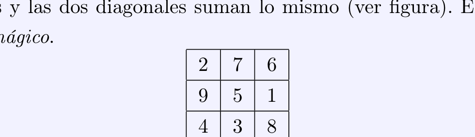
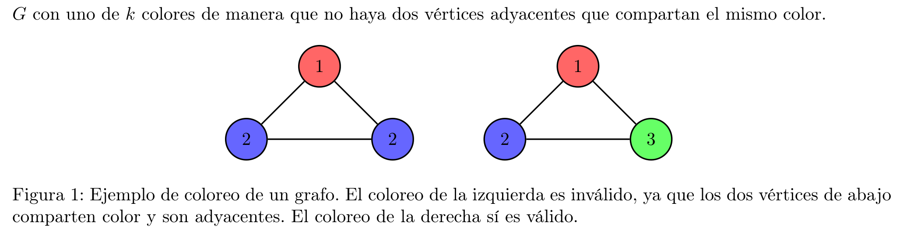

# Práctica 5: Backtracking
**Técnicas de Diseño de Algoritmos / Algoritmos y Estructuras de Datos III**  
*Ejercicios de Contenido Mínimo (★)*

---

## Formalización de problemas

### Ejercicio 1 (Suma Subconjuntos: formalización) ⋆

**Problema: Suma Subconjuntos**

Dado un multiconjunto $C := \{c_1, \dots, c_n\}$ de números naturales y un natural $k$, queremos determinar si existe un subconjunto de $C$ cuya sumatoria sea $k$. Vamos a suponer que $C$ está ordenado de alguna forma arbitraria pero conocida (i.e., $C$ está implementado como la secuencia $c_1, \dots, c_n$ o, análogamente, tenemos un iterador de $C$).

Vamos a traducir el problema Suma Subconjuntos a otro formalismo. Proponemos las siguientes definiciones:

a) Las soluciones (candidatas) (denotadas como el conjunto $\text{Sols}$) se representan con un arreglo de booleanos, es decir, con los vectores $a := (a_1, \dots, a_n)$ de valores binarios; el subconjunto de $C$ representado por $a$ contiene a $c_i$ si y sólo si $a_i = 1$. Escribir el conjunto de soluciones candidatas para $C := \{6, 12, 6\}$ y $k := 12$.

b) El predicado de validación $\text{válida}_{C,k}(a)$ determina si una solución candidata $a$ es válida o no. La definimos de la siguiente manera:

$$
\text{válida}_{C,k}(a) := \left[ \sum_{i=1}^n a_i c_i = k \right]
$$

Escribir el conjunto de soluciones candidatas $\text{Sols}_{\text{válidas}}$ para las cuales $\text{válida}_{C,k}(a)$ es verdadero para $C := \{6, 12, 6\}$ y $k := 12$.

c) Notar que el problema nos pide determinar si el siguiente predicado es verdadero o falso para unos $C$ y $k$ dados:

$$
\text{ss}(C, k) := [\exists a \in \text{Sols} : \text{válida}_{C,k}(a)]
$$

Determinar si $\text{ss}(C, k)$ es verdadero o falso para $C := \{6, 12, 6\}$ y $k := 12$.

d) A Cecilia, en cambio, se le ocurrió otro conjunto de soluciones candidatas y de predicado de validación. Sus soluciones candidatas $\text{Sols}'$ son todos los posibles conjuntos de números naturales, y dice que una solución candidata $\text{sol}$ es válida si cumple lo siguiente:

$$
\text{válida}'_{C,k}(\text{sol}) := \left[ \text{sol} \subseteq C \land \sum_{s \in \text{sol}} s = k \right]
$$

Dado un $C$ y un $k$, ¿qué conjunto es más grande, el conjunto $\text{Sols}$ o el conjunto $\text{Sols}'$ de Cecilia? Si tuvieran que hacer un algoritmo de fuerza bruta que enumere todas las soluciones candidatas y determine si $\text{ss}(C, k)$ es verdadero o falso chequeando cada una, ¿qué conjunto elegirían iterar?

e) Finalmente, Roberto decide que $\text{Sols}^{\ast}$ sea exactamente el conjunto $\text{Sols}_{\text{válidas}}$. Su predicado de validación es entonces $\text{válida}^{\ast}_{C,k}(a) := \text{True}$. ¿Se les ocurre un algoritmo de fuerza bruta que recorra solamente las soluciones en $\text{Sols}^{\ast}$, sin recorrer ninguna otra? (Vale decir que no.)

---

### Ejercicio 2 (MagiCuadrados: formalización) ⋆

**Problema: MagiCuadrados**

Un cuadrado mágico de orden $n$ es una grilla cuadrada de lado $n$ con los números $\{1, \dots, n^2\}$ tal que todas sus filas, columnas y las dos diagonales suman lo mismo (ver figura). El número que suma cada fila es llamado *número mágico*.



Se pide contar cuántos cuadrados mágicos de orden $n$ existen.

a) Dar dos propuestas distintas de soluciones candidatas $\text{Sols}$ y predicados de validación $\text{válida}_n(a)$ con $a \in \text{Sols}$ para este problema.

b) Dar un ejemplo de solución candidata no válida y otra válida para cada propuesta.

c) Para cada propuesta, reescribir al problema en términos de determinar el valor de una función $\text{mc} : \mathbb{N} \to \mathbb{N}$, donde la entrada es el orden $n$ del cuadrado mágico.

---

### Ejercicio 3 (MaxiSubconjunto: formalización) ⋆

**Problema: MaxiSubconjunto**

Dada una matriz simétrica $M$ de $n \times n$ números naturales y un número $k$, queremos encontrar un subconjunto $I$ de $\{1, \dots, n\}$ con $|I| = k$ que maximice $\sum_{i,j \in I} M_{ij}$. Los índices de las filas y columnas empiezan en 1. Por ejemplo, si $k := 3$ y

$$
M := \begin{pmatrix}
0 & 10 & 10 & 1 \\
10 & 0 & 5 & 2 \\
10 & 5 & 0 & 1 \\
1 & 2 & 1 & 0
\end{pmatrix}
$$

entonces $I := \{1, 2, 3\}$ es una solución óptima, cuyo valor es $10 + 10 + 10 + 5 + 10 + 5 = 50$.

a) Dar una propuesta de conjunto de soluciones candidatas $\text{Sols}$ y predicado de validación $\text{válida}_{M,k}(a)$ con $a \in \text{Sols}$ para este problema.

b) En este problema nos interesa encontrar una solución que maximice una fórmula. En otras palabras, estamos buscando encontrar un máximo del conjunto $\text{Sols}_{\text{válidas}}$ según un orden $\le$ entre soluciones válidas. Determinar cuál es ese orden, es decir, determinar cuándo dos soluciones válidas $a, b \in \text{Sols}_{\text{válidas}}$ satisfacen $a \le b$ y cuándo no.

---

## Repaso de combinatoria

### Ejercicio 4 (Quiz combinatorio) ⋆

1. ¿Cuántas hojas tiene un árbol binario completo de $n$ niveles?
   - a) $\Theta(n)$
   - b) $\Theta(n^2)$
   - c) $\Theta(2^n)$
   - d) $\Theta(n!)$

2. Una permutación de un conjunto es una disposición de sus elementos en una secuencia ordenada, sin repetidos. ¿Cuántas permutaciones hay para un conjunto de tamaño $n$?
   - a) $\Theta(n)$
   - b) $\Theta(n^2)$
   - c) $\Theta(2^n)$
   - d) $\Theta(n!)$

3. El conjunto de partes de un conjunto $A$, denotado como $\mathcal{P}(A)$, es un nuevo conjunto cuyos elementos son todos los subconjuntos de $A$. Si $A$ tiene $n$ elementos, ¿cuántos elementos tiene $\mathcal{P}(A)$?
   - a) $\Theta(n)$
   - b) $\Theta(n^2)$
   - c) $\Theta(2^n)$
   - d) $\Theta(n!)$

4. Tengo $n$ libros que quiero dividir en $k$ cajas distintas. ¿Cuántas combinaciones tengo?
   - a) $\Theta(n \cdot k)$
   - b) $\Theta(n^k)$
   - c) $\Theta(k^n)$
   - d) $\Theta\left(\binom{n}{k}\right)$

5. Quiero llevar $n$ objetos de mi casa a la facultad, pero en mi mochila solo entran $k < n$. ¿Cuántas combinaciones distintas de objetos podría llevar a la facultad?
   - a) $\Theta(n \cdot k)$
   - b) $\Theta(n^k)$
   - c) $\Theta(k^n)$
   - d) $\Theta\left(\binom{n}{k}\right)$

---

## Backtracking

### Ejercicio 5 (Suma Subconjuntos: árbol de backtracking) ⋆

Definimos una solución parcial como un vector $p := (a_i, \dots, a_n)$ de números binarios con $1 \le i \le n + 1$. El conjunto de todas las soluciones parciales es denotado $\text{Sols}_{\text{parciales}}$. Si $i > 1$, las soluciones sucesoras de $p$ son $0 \oplus p$ y $1 \oplus p$, donde $\oplus$ indica la concatenación. Se le puede dar una semántica a estas soluciones parciales: un vector $p := (a_i, \dots, a_n)$ representa un subconjunto del conjunto $C_{\ge i} := \{c_i, \dots, c_n\}$.

a) Escribir el conjunto de soluciones parciales para $C := \{6, 12, 6\}$ y $k := 12$, y determinar cuáles son sucesoras de cada una.

b) Representar las relaciones de sucesión como un árbol enraizado, donde la solución parcial vacía $()$ es la raíz. A esto se le llama un árbol de backtracking del problema.

---

### Ejercicio 6 (Suma Subconjuntos: recurrencia) ⋆

Sea $\mathcal{C}$ la familia de todos los multiconjuntos de números naturales. Considerar la siguiente función recursiva $ss_{\text{rec}} : \mathcal{C} \times \mathbb{Z} \to \text{Bool}$:

$$
ss_{\text{rec}}(\{c_1, \dots, c_n\}, k) := \begin{cases}
k = 0 & \text{si } n = 0 \\
ss_{\text{rec}}(\{c_1, \dots, c_{n-1}\}, k) \lor ss_{\text{rec}}(\{c_1, \dots, c_{n-1}\}, k - c_n) & \text{si } n > 0
\end{cases}
$$

a) Demostrar por inducción en $n$ que $ss_{\text{rec}}(C, k) = \text{ss}(C, k)$ para todos $C \in \mathcal{C}$ y $k \in \mathbb{Z}$. Recordar la definición de $\text{ss}(C, k)$ del ejercicio 1. Para ello, observar que si existe una solución válida para $(\{c_1, \dots, c_n\}, k)$ con $n > 0$, entonces hay dos posibilidades para $a_n$: o bien $a_n = 0$, o bien $a_n = 1$. En el primer caso, existe un subconjunto de $\{c_1, \dots, c_{n-1}\}$ que suma $k$; en el segundo, existe un subconjunto de $\{c_1, \dots, c_{n-1}\}$ que suma $k - c_n$.

b) Dibujar el árbol de llamadas recursivas para la entrada $C := \{6, 12, 6\}$ y $k := 12$, indicando claramente la relación entre las distintas componentes del árbol y los conjuntos de soluciones de los ejercicios 1 y 5. Comparar con el árbol de backtracking del ejercicio 5.

---

### Ejercicio 7 (Suma Subconjuntos: implementación) ⋆

Considerar el siguiente algoritmo recursivo:

```text
function subset_sum(C, i, j)
    if i == 0 then
        return (j == 0)
    else
        return subset_sum(C, i - 1, j) ∨ subset_sum(C, i - 1, j - C[i])
```

a) Convencerse que `subset_sum(C, |C|, k)` computa $ss_{\text{rec}}(C, k)$.

b) ¿Cuáles son las complejidades temporal y espacial de `subset_sum(C, |C|, k)`?

---

### Ejercicio 8 (Suma Subconjuntos: poda por factibilidad) ⋆

Considerar la siguiente regla de factibilidad para Suma Subconjuntos: $p := (a_i, \dots, a_n)$ se puede extender a una solución válida sólo si:

$$
\sum_{q=i}^n a_q c_q \le k
$$

```text
function subset_sum_poda(C, i, j)
    if j < 0 then
        return false    // regla de factibilidad
    if i == 0 then
        return (j == 0)
    else
        return subset_sum_poda(C, i - 1, j) ∨ subset_sum_poda(C, i - 1, j - C[i])
```

a) Demostrar que la regla es correcta, es decir, que si una solución parcial $p$ no cumple la regla, entonces todas las soluciones que tengan a $p$ como sufijo no son válidas.

b) Convencerse de que la implementación incluye la regla de factibilidad.

c) Dibujar el árbol de llamadas recursivas de `subset_sum_poda(C, |C|, k)` para la entrada $C := \{6, 12, 6\}$ y $k := 12$. Comparar con el árbol de llamadas recursivas de `subset_sum(C, |C|, k)` y con el árbol de backtracking del ejercicio 5. ¿En qué casos se podan ramas del árbol?

d) ¿Podemos decir algo nuevo sobre las complejidades temporal y espacial en el peor caso de `subset_sum_poda(C, |C|, k)`? *(ver ayuda al final)*

e) Definir otra regla de factibilidad, demostrando que la misma es correcta; no es necesario implementarla.

---

### Ejercicio 9 (Suma Subconjuntos: construcción de solución) ⋆

Modificar la implementación de `subset_sum` para imprimir el subconjunto de $C$ que suma $k$, si existe. *(ver ayuda al final)*

---

### Ejercicio 10 (Suma Subconjuntos: enumeración) ⋆

Modificar la implementación del algoritmo del Ejercicio 9 para imprimir todos los subconjuntos de $C$ que suman $k$. ¿Cómo cambia la complejidad temporal?

---

### Ejercicio 11 (MagiCuadrados: backtracking y podas) ⋆

a) Para cada una de sus propuestas de soluciones candidatas del Ejercicio 2a), ¿cuántas soluciones habría que generar para encontrar todos los cuadrados mágicos si se utiliza un algoritmo de fuerza bruta?

b) Definir un conjunto de soluciones parciales para el problema MagiCuadrados basándose en alguna de sus propuestas de soluciones candidatas en el Ejercicio 2a). Definir una relación de sucesión entre soluciones parciales. *(ver ayuda al final)*

c) Mostrar los primeros dos niveles del árbol de backtracking para $n = 3$.

d) Demostrar que el árbol de backtracking tiene $O((n^2)!)$ nodos en peor caso.

e) Considere la siguiente poda al árbol de backtracking: al momento de elegir el valor de una nueva posición, verificar que la suma parcial de la fila no supere el número mágico. Verificar también que la suma parcial de los valores de las columnas no supere el número mágico. Introducir estas podas al algoritmo e implementarlo en la computadora. ¿Puede mejorar estas podas?

f) Demostrar que el número mágico de un cuadrado mágico de orden $n$ es siempre:

$$
\frac{n^3 + n}{2}
$$

Adaptar la poda del algoritmo del ítem anterior para que tenga en cuenta esta nueva información. Modificar la implementación y comparar los tiempos obtenidos para calcular la cantidad de cuadrados mágicos.

---

### Ejercicio 12 (MaxiSubconjunto: backtracking) ⋆

a) Dar una función recursiva para resolver el problema MaxiSubconjunto utilizando los conjuntos de soluciones y la relación de orden definidos en el Ejercicio 3. Indicar qué es una solución parcial y cómo se extiende cada solución parcial.

b) Demostrar que la función recursiva es correcta. Dar una semántica para la función; es decir, dados unos parámetros fijos, determinar qué significa el resultado de la función, escrito como una fórmula matemática. Demostrar por inducción que la semántica que dieron es correcta para toda entrada.

c) Calcular la complejidad temporal y espacial del mismo.

d) Proponer una poda por optimalidad y mostrar que es correcta.

e) ¿Cómo modificarían su solución si el problema pidiese minimizar $\sum_{i,j \in I} M_{ij}$ en vez de maximizarlo?

---

### Ejercicio 13 (Coloreo) ⋆

**Problema: Coloreo de Grafos**

Dado un grafo $G$ y un entero $k$, el problema de coloreo consiste en decidir si es posible pintar cada vértice de $G$ con uno de $k$ colores de manera que no haya dos vértices adyacentes que compartan el mismo color.



*Figura 1: Ejemplo de coloreo de un grafo. El coloreo de la izquierda es inválido, ya que los dos vértices de abajo comparten color y son adyacentes. El coloreo de la derecha sí es válido.*

a) Dar una función recursiva que resuelva el problema.

b) De ser posible, agregar una poda por factibilidad.

c) Calcular una cota superior para la complejidad de implementar esa función con backtracking.

d) Demostrar que el algoritmo es correcto, definiendo los conjuntos de soluciones, las relaciones entre soluciones, y las semánticas que sean necesarios.

e) Modificar el algoritmo para que devuelva un coloreo válido, si es que existe.

---

## Ayudas

### Ejercicio 8
Considerar el caso en el que $\sum_{i=1}^{|C|} c_i \le k$.

### Ejercicio 9
Mantener un vector con la solución parcial $p$ al que se le agregan y sacan los elementos en cada llamada recursiva; tener en cuenta de no suponer que este vector se copia en cada llamada recursiva, porque cambia la complejidad.

### Ejercicio 11
Pueden consultar las transparencias de la teórica sobre árboles de backtracking. También pueden servir las siguientes ideas:
- La solución parcial tiene los valores de las primeras $i - 1$ filas establecidos, al igual que los valores de las primeras $j$ columnas de la fila $i$.
- Para establecer el valor de la posición $(i, j + 1)$ (o $(i + 1, 1)$ si $j = n$ e $i \ne n$) se consideran todos los valores que aún no se encuentran en el cuadrado. Para cada valor posible, se establece dicho valor en la posición y se cuentan todos los cuadrados mágicos con esta nueva solución parcial.
